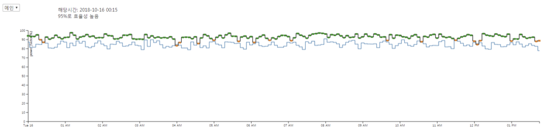

   

# EA (Energy Assistant)

실시간 에너지 사용량 모니터링이 가능한 웹 페이지 입니다.

> 덕성여자대학교 2018 IT미디어공학과 졸업작품 

 

:zap: 정전기 팀 :zap:  

[Kim Ji Yeon](https://www.github.com/jiyeonkim7) & [Kim Min Joo](https://www.github.com/minjooda) & [Kim Ji Eun](https://www.github.com/sliveryy)

  

---

## 작품 소개

 소규모 공장과 상업용 빌딩 고객의 EMS의 실효성 대비 가격 저항이 매우 큽니다. 사용자가 한국 전력에서 제공받는 정보의 대부분은 한 건물 전체에서 사용한 전력량으로, 어느 기기 또는 어느 부서에서 전기가 더 사용되는지, 덜 사용되는지 파악하지 못합니다. 따라서 이전에는 전기 요금 절감을 위해 모든 부서의 전력량을 전체적으로 줄였어야 했습니다. 
 
 그러나 값싼 **L-EMS(Light-Energy Management Service)**을 각 기기에 부착하면 기기별, 부서별로 세부적인 전력량 파악할 수 있습니다. L-EMS를 통해 각각의 부서별 사용량을 알게 되면 모든 부서의 사용량을 줄일 필요 없이 비효율적으로 전력을 사용한 부서의 사용량을 분석하고 컨설팅을 통해 전력량을 줄여 효율적인 전기 소비가 가능합니다. 해당 부서의 전력량을 줄이는 것만으로 전체적인 사용량을 감소시켜 전기 요금을 절약하는데 많은 도움이 됩니다.
 
 이렇게 축적된 데이터들을 단순히 텍스트로만 보여준다면 사용자가 얼마나 전기를 사용했는지 파악하기에 어렵습니다. 따라서 **데이터를 시각화**하여 차트를 통해 보여줌으로써 데이터를 보다 쉽게 비교, 분석할 수 있도록 도와줍니다. 전기 요금은 계약전력에 의해 계산되고, 계약전력은 일 년 동안 순간 최대 전력을 기준으로 결정됩니다. 사용자가 그래프를 통해 최대 전력을 한눈에 찾아내어 보다 효과적으로 관리할 수 있도록 하였고 데이터 분석을 통한 전기 사용 패턴을 나타내 줌으로써 나아가 전기 요금을 줄일 수 있도록 도와줍니다.

 공개 DB에서 크롤링한 데이터를 json 형태로 가공하여 mongoDB에 저장합니다.
 저장된 데이터를 기반으로 javascript 라이브러리인 D3.js를 사용하여 총 7개의 차트를 제작했습니다. 시계열 그래프를 사용하여 시간의 흐름에 따른 데이터 변화를 보여주고 donut, bubble chart와 같은 분포 그래프 사용하여 부서별 사용량을 비교할 수 있도록 하였습니다.

  

## 작품 설명

 * **금일 데이터 그래프 (donut chart) / 전기요금 그래프 (line chart)**

 

 * **역률 그래프 (step line chart)**

 

 * **전력 사용량 그래프 (bar chart + stacked area chart)**

 

 * **요일/시간별 전력 소비 패턴 그래프 (heatmap chart + bubble chart)**

